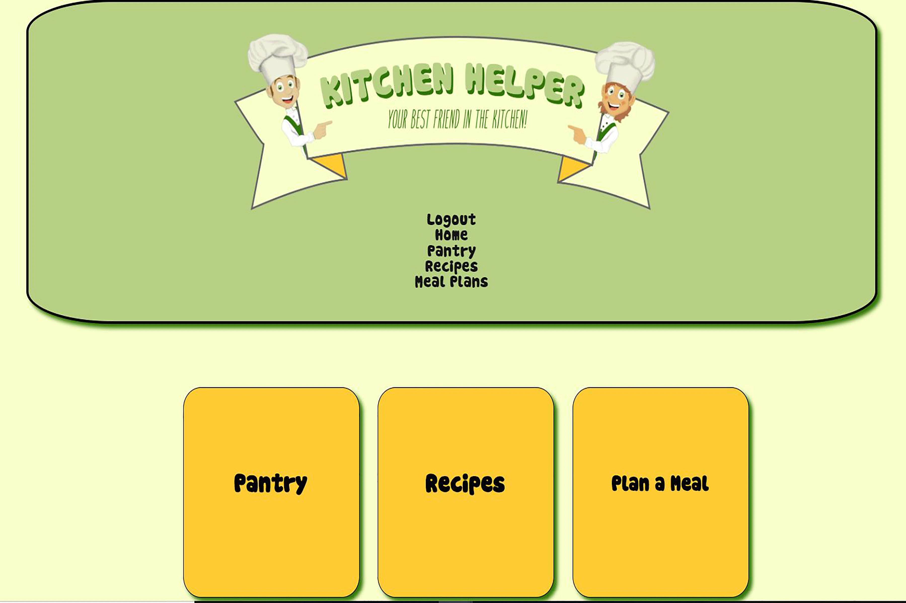
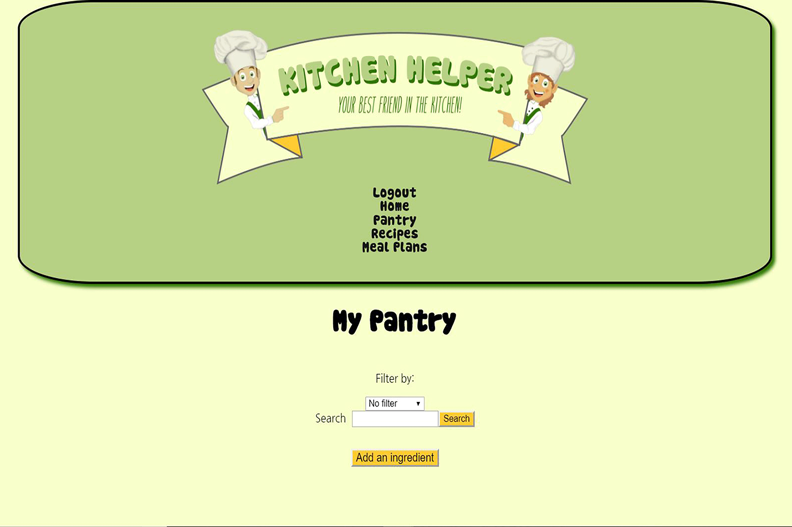
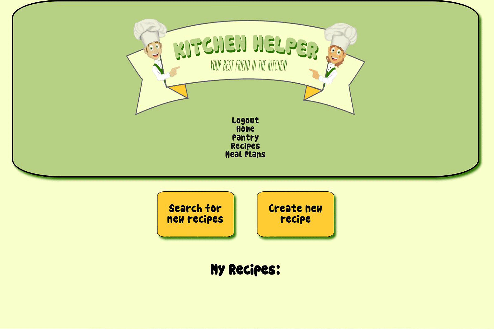
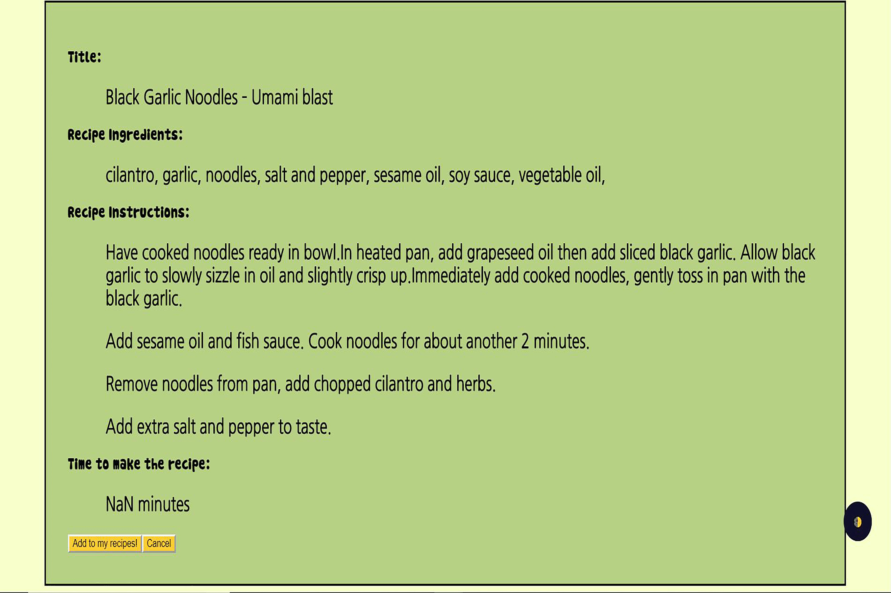
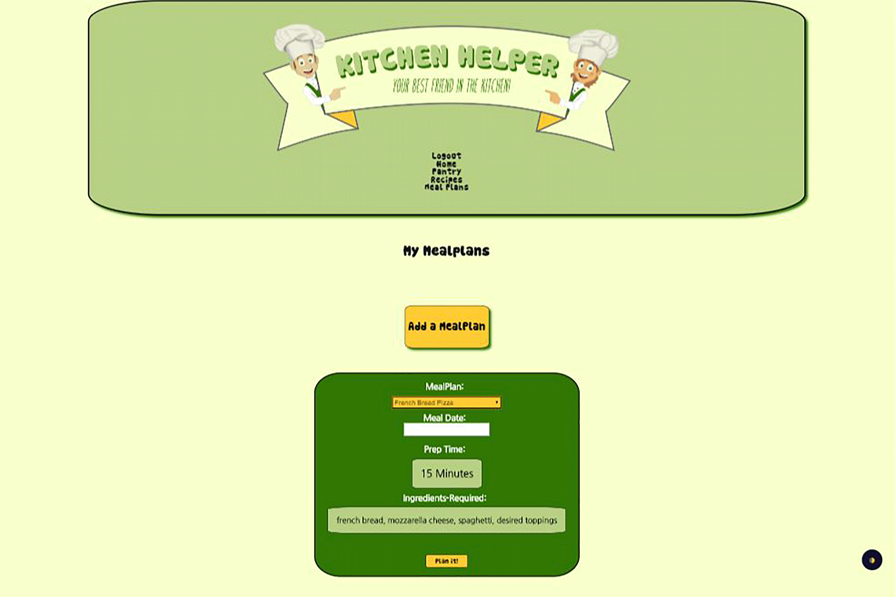

# Kitchen Helper:

    Kitchen Helper is a best friend in the kitchen.
    This app combines the ability to track the items in your pantry,
    the opportunity to plan your meals for a given time period and puts a
    large database of recipes at your fingertips. This app also allows
    you to create and add your own recipes. 

## Contributors:

- Maggie McClellan
- Calvin Rosehart
- Anugrah Lambogo
- Christina Chapman

## Visit Kitchen Helper:

  * [Client Side Repo](https://github.com/thinkful-ei-iguana/Delta-Squad-Front-End)

  * [Live App](https://delta-squad-app.now.sh/)
  
  
## Screenshots:

   

   

      

   

   
   
   
   
   

## Technologies:

**Front End Tech:** HTML, CSS, JavaScript, React, Modal, Widgets(Dark Mode)

**Back End Tech:** NodeJs, ExpressJs, PostgreSQL

**Testing Tech:** Jest, Snapshot, Enzyme, Lodash, Mocha, Chai

## API Documentation:

   ### Pantry: 

| **HTTP Verb** | **Path**                           | **Used for**         |
| --------- |:--------------------------------------:| --------------------:|
| GET       | /pantry | view user's ingredients |
| POST      | /pantry | add new ingredient |
| PATCH     | /pantry/:ingredient_id | update/edit ingredient |
| DELETE    | /pantry/:ingredient_id | delete ingredient |

  ### Recipes:
  
| **HTTP Verb** | **Path**                           | **Used for**         |
| --------- |:--------------------------------------:| --------------------:|
| GET       | /recipes | view user's saved recipes  |
| POST       | /recipes | add new recipe |
| PATCH     | /recipes/:recipe_Id | update/edit recipe |
| GET       | /recipes/:recipe_Id | delete recipe |

  ### Meal Plans: 
  
| **HTTP Verb** | **Path**                           | **Used for**         | 
| --------- |:--------------------------------------:| --------------------:|
| GET       | /planner | view user's meal plans |
| POST      | /planner | add new meal plan  |
| PATCH     | /planner/:mealplan_owner | update/edit meal plan |
| GET       | /planner/:mealplan_owner | delete meal plan |
